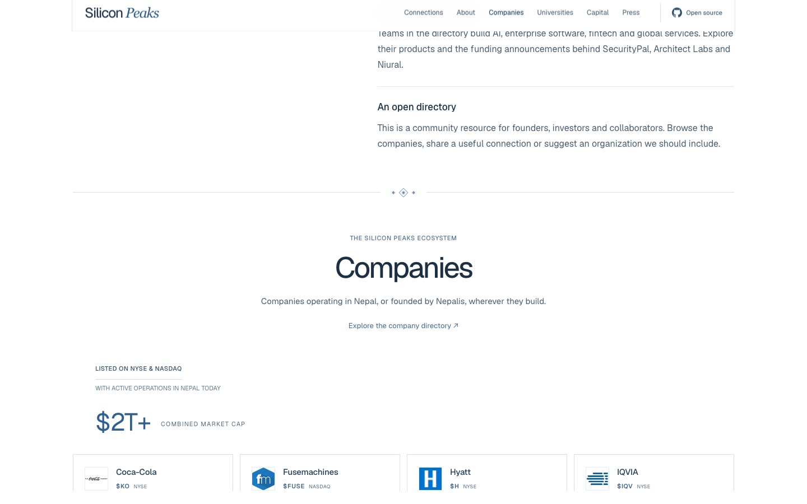

# Directory corrections, 29 September 2026

The following changes were checked against the supplied official websites. Logos are hosted locally and do not require third-party requests from visitors.

| Entry | Website | Logo treatment |
| --- | --- | --- |
| r0 Capital, formerly Uncorrelated Capital | https://r0capital.com/ | Official standalone mark |
| Uncommon Capital | https://investuncommon.com/ | Official standalone mark |
| Tectonic Capital | https://tectonic.vc/ | Blue symbol cropped from its published vector wordmark; the generic site-builder favicon is excluded |
| DBA | https://dba.xyz/ | Header wordmark with the site's computed light-theme color; the blank favicon is excluded |
| AITC International | https://aitc.ai/ | Official header SVG |
| ARKBO Tech | https://www.arkbotech.com/ | Official icon, resized to 160 pixels |
| Alpas Technology | https://alpastechnology.com/ | Official white logo on a dark background for contrast |
| Naamche Labs | https://naamchelabs.com/ | Official favicon; added separately from the existing Naamche company |
| Flowli Studio | https://flowli.studio/ | Official icon, resized to 160 pixels |
| Y Combinator | https://www.ycombinator.com/ | Existing vector confirmed against YC's own navigation logo; excess SVG padding removed and display size increased |

One Point at `onepoint.com.np` was removed as requested. OnePoint Financial at `myonepoint.com` remains. The directory now contains 113 unique companies, rendered as 114 homepage cards including the final placeholder, and 48 investors.

Exact asset URLs and transformations are recorded in [directory.json](../data/directory.json) and [logo-audit.json](../data/logo-audit.json). All ten reviewed images decode in Chromium. Updated links appear on the homepage, search pages, structured data and LLM directory output.

## Layout follow-up

- Press rows have consistent internal padding and separated publisher, title and arrow columns.
- The publisher-homepage disclosure was removed; six selected articles and ten archive stories remain.
- The featured strip is centered and no longer includes the extra coverage call to action.
- Community organizations and diaspora headings are centered.
- A restrained geometric motif inspired by Nepali Dhaka patterns separates all ten main content transitions. The hero remains attached to its featured-publication strip.
- The hero and footer artwork are unchanged. The mountain profiles continue to use credited real photographs.

All 10 tests pass. Desktop and mobile checks find no horizontal overflow, no stale corrected-domain links, and no console errors after a clean reload. The SVG padding fix makes YC visible without altering its official design.

## Logos still needing verified sources

These older records retain readable names, initials or the appropriate flag. This list concerns logo availability, not whether the organizations exist.

- Addressgraph
- Dots n Dashes
- Facet Tech
- Jasper IT
- Machnet
- Maitri Holdings
- Outside Studio
- Rite Teams
- Smarten Tech
- Trilokya Tech
- French Embassy Nepal

